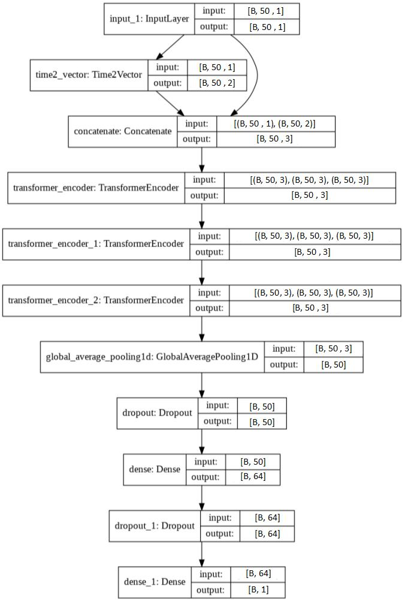

# Transformer-for-stock-price-predictions

This project is a pytorch implementation for pretraining a transformer-based model to perform stock-price predictions. The model is trained on EUR/USD forex pairs (Frame 1H), but you can change the input file by any other stock-price pairs. The transformer-based model is a variant from the vanilla transformer [https://proceedings.neurips.cc/paper_files/paper/2017/hash/3f5ee243547dee91fbd053c1c4a845aa-Abstract.html]. The architecture is shown in the following figure:




# Results: 

The model performs very well in traing, test, and validation dataset with MSE less than E-3

## Dependency
Python 3.8
Pytorch 2.1.0

## Train

```bash
python initial.py
```


